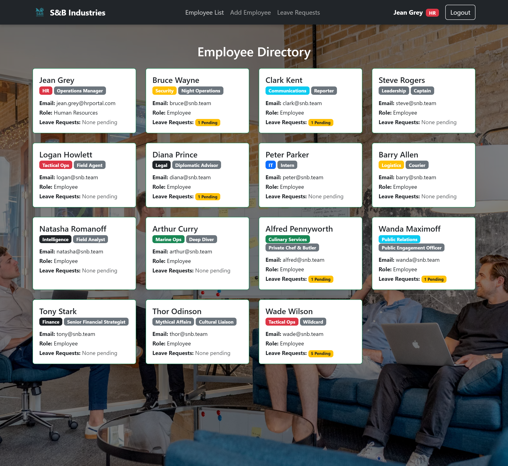
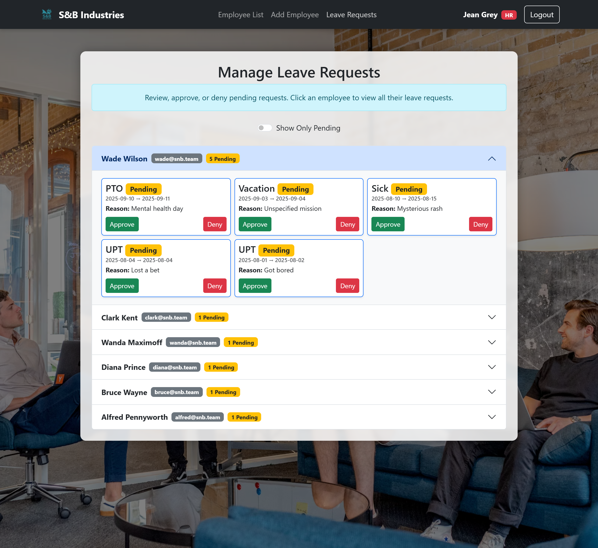

# HR Portal – React App


[](https://react-hr-portal.netlify.app)

## 📋 Description

HR Portal is a responsive, front-end simulation of a Human Resources system built with React, React Bootstrap, and localStorage. It allows HR users to manage employee records and handle leave requests, while employees can submit and track their own leave. Everything runs entirely on the front end using localStorage.
Built as part of my full-stack development journey, this project demonstrates React fundamentals, component-based structure, context-driven state, and role-based routing.

---

## 🌐 Live Demo

Check it out here:
🔗 [https://react-hr-portal.netlify.app](https://react-hr-portal.netlify.app)

---

## 📂 Table of Contents

* [Installation](#installation)
* [Usage](#usage)
* [Features](#features)
* [Demo Credentials](#demo-credentials)
* [Screenshots](#screenshots)
* [Technologies Used](#technologies-used)
* [Project Structure](#project-structure)
* [Future Development](#future-development)
* [Known Limitations](#known-limitations)
* [Author](#author)
* [License](#license)

---

## 🛠 Installation

To run locally:

```bash
git clone https://github.com/SlemJosh/hr-portal-react.git
cd hr-portal-react
npm install
npm start
```

Make sure you have [Node.js](https://nodejs.org/) and [npm](https://www.npmjs.com/) installed.
To build for deployment:

```bash
npm run build
```

---

## ▶️ Usage

* Login using demo credentials or sign up as a new HR user
* HR users can:

  * View and manage employee directory
  * Add new employees (assigned default passwords)
  * View and approve/cancel leave requests
* Employees can:

  * Submit leave requests
  * Cancel pending requests
* Use the **Reset Demo** button (on Jean Grey’s dashboard) to restore the app to default data

<details>
<summary>🧹 Trouble seeing your dashboard?</summary>
After signing up, be sure to select **"Human Resources"** as your department to unlock HR access.  
If your dashboard doesn’t load correctly the first time, try refreshing the page.
</details>

---

## ✨ Features

* Role-based login with protected routing
* HR and Employee dashboards
* Add/edit/remove employees (HR only)
* Submit and manage leave requests (Employee only)
* React Context API for real-time state sync
* Responsive UI with Bootstrap cards and badges
* Toast notifications for actions (via react-toastify)
* Preloaded demo data and reset function

---

## 🔐 Demo Credentials

**Preloaded HR User**

* Email: `jean.grey@snb.team`
* Password: `admin123`
  Jean Grey is the default HR Operations Manager and **cannot be deleted**.

**Signup Option**

* You can sign up as an HR user via the login page.
  Be sure to choose `Human Resources` from the role dropdown to access HR features.

**Employee Accounts**

* Any new employees created via the HR dashboard are assigned a default password: `temp1234`.

---

## 📸 Screenshots

### 1. Login Screen


---

### 2. HR Dashboard (Jean Grey)


---

### 3. Employee Directory



---

### 4. Leave Requests



---

## 🧰 Technologies Used

* React 18
* React Router v6
* React Bootstrap
* React Toastify
* JavaScript (ES6+)
* HTML/CSS
* LocalStorage
* Netlify (for deployment)

---

## 📁 Project Structure

```
src/
├── components/
│   ├── auth/             # Login & Signup forms
│   ├── employee/         # LeaveRequest, EmployeeDashboard
│   ├── hr/               # AddEmployee, ViewEmployees
│   └── shared/           # Navbar, Footer, ProtectedRoute
├── context/              # AuthContext and EmployeeContext
├── data/                 # Default JSON user and employee data
├── App.jsx               # Main routing and layout
└── index.js              # Entry point
```

---

## 🚧 Future Development

* Unique ID generation for employees (not based on email)
* Real password encryption & reset logic
* Search, filter, and sort options in employee directory
* Persistent sessions and login retention
* Enhanced leave request filtering and history
* Optional profile photo support
* Admin dashboard with charts/metrics
* Integration with real backend (e.g. MongoDB + Express)
* Refactor shared page styling (e.g. background overlays) into reusable utility classes for better maintainability

---

## ⚠ Known Limitations

* All data is stored in `localStorage` by design — no backend or encryption included
* No true authentication or password hashing
* Not yet optimized for accessibility (no a11y audit)

---

## 👤 Author

**Joshua Grant Slem**
GitHub: [SlemJosh](https://github.com/SlemJosh)
Email: [joshua.slem@gmail.com](mailto:joshua.slem@gmail.com)
*(also known as GrayBear — in design, gaming, and dev circles)*

---

## 📄 License

This project is licensed under the [MIT License](https://opensource.org/licenses/MIT).
